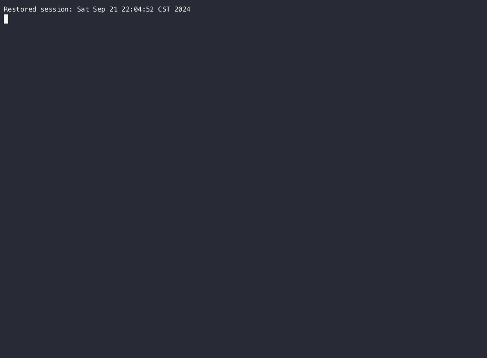

# Gencoder [](https://github.com/DanielLiu1123/gencoder/actions) [](https://goreportcard.com/report/github.com/DanielLiu1123/gencoder) [](./LICENSE)

A code generator that keeps your changes during regeneration, powered by Handlebars.

## Table of Contents

- [Background](#background)
- [Install](#install)
- [Quick Start](#quick-start)
- [Contributing](#contributing)

## Background

You cannot add code to the generated code because it will be overwritten the next time you generate it.
In the real world, code generators are often used to create some boilerplate code (like CRUD operations),
then you develop your own code based on it. However, when you regenerate the code, your changes will be overwritten,
and you have to merge them manually (which is very annoying).

Gencoder is designed to solve this problem. It can recognize which parts of the file are generated and which parts are manually added. 
When regenerating, it only overwrites the automatically generated parts,
and the manual parts remain unchanged. No more manual merging.

## Install

```bash
go install github.com/DanielLiu1123/gencoder/cmd/gencoder@latest
```

Build from source:

```bash
make && CGO_ENABLED=0 go build -o gencoder cmd/gencoder/main.go
```

## Quick Start



Run a MySQL server (not shown on the previous gif):

```bash
docker rm -f test_mysql && docker run --name test_mysql -e MYSQL_ROOT_PASSWORD=root -e MYSQL_DATABASE=testdb -p 3306:3306 -p 33060:33060 -id mysql:latest && sleep 10 && docker exec -i test_mysql mysql -uroot -proot -e "\
    CREATE TABLE testdb.user ( \
        id INT AUTO_INCREMENT PRIMARY KEY, \
        username VARCHAR(64) NOT NULL COMMENT 'Username, required', \
        created_at TIMESTAMP DEFAULT CURRENT_TIMESTAMP COMMENT 'Record creation timestamp' \
    ) COMMENT='User account information';"
```

Init basic configuration:

```bash
gencoder init -o gencoder-test && cd gencoder-test
```

First time generate:

```bash
gencoder generate
```

Modify the generated code:

```diff
/**
 * @gencoder.block.start: table
 */
public record User (
    // ...

-   // NOTE: you can't make changes in the block, it will be overwritten by generating again
+   // NOTE: YOU CAN'T MAKE CHANGES IN THE BLOCK, IT WILL BE OVERWRITTEN BY GENERATING AGAIN

    // @gencoder.block.end: table
) {

-   // TIP: you can make changes outside the block, it will not be overwritten by generating again
+   // TIP: YOU CAN MAKE CHANGES OUTSIDE THE BLOCK, IT WILL NOT BE OVERWRITTEN BY GENERATING AGAIN
    public void hello() {
        System.out.println("Hello, World!");
    }
}
```

Generate again:

```bash
gencoder generate
```

Check the changes:

```diff
/**
 * @gencoder.block.start: table
 */
public record User (
    // ...

-   // NOTE: YOU CAN'T MAKE CHANGES IN THE BLOCK, IT WILL BE OVERWRITTEN BY GENERATING AGAIN
+   // NOTE: you can't make changes in the block, it will be overwritten by generating again

    // @gencoder.block.end: table
) {

    // TIP: YOU CAN MAKE CHANGES OUTSIDE THE BLOCK, IT WILL NOT BE OVERWRITTEN BY GENERATING AGAIN
    public void hello() {
        System.out.println("Hello, World!");
    }
}
```

Only the code in the block will be overwritten, and the code outside the block will remain unchanged.

## Contributing

The [issue tracker](https://github.com/DanielLiu1123/gencoder/issues) is the preferred channel for bug reports, feature requests and submitting pull requests.

If you would like to contribute to the project, please refer to [Contributing](./CONTRIBUTING.md).

## License

The MIT License.
